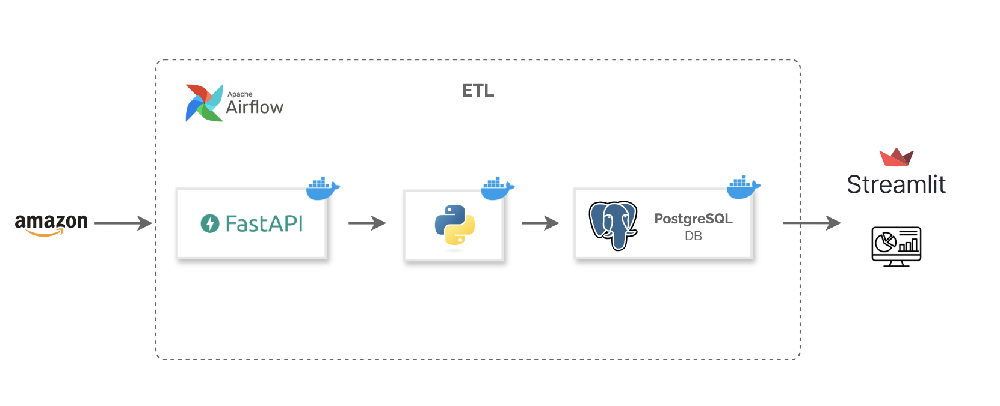
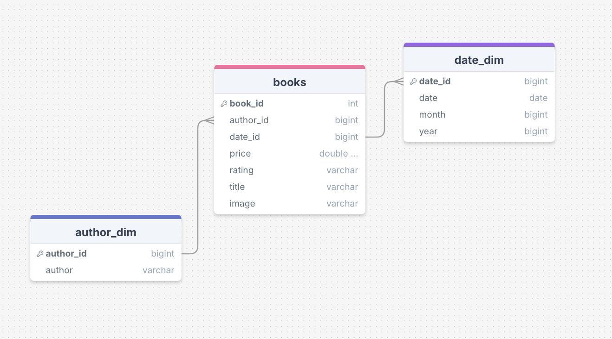
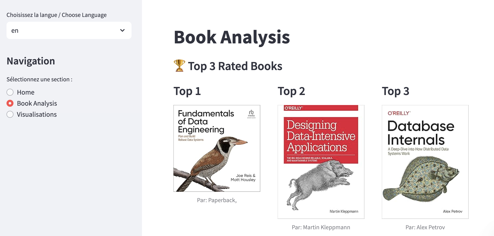

# 📚 Amazon Scraping Project with FastAPI, Airflow, Docker, and Streamlit

## 🌟 Description

Welcome to our scraping project that collects data on **data engineering books** from Amazon. The collected data is integrated into a **PostgreSQL** database via **Apache Airflow**, and we visualize it using **Streamlit** to extract valuable insights.

## 🏗️ Project Architecture



## ⚙️ Technologies Used

- **FastAPI**: For API calls and scraping.
- **Apache Airflow**: For orchestrating data collection.
- **Docker**: For containerizing the services.
- **Streamlit**: For data visualization.
- **PostgreSQL**: For data storage.

## 📊 Data Modeling

The data collected from Amazon is structured into a schema suitable for analysis. Here’s a brief overview of the data model:

- **Books Table**:

  - **book_id** (Primary Key): Unique identifier for each book.
  - **author_id**: The author(s) of the book.
  - **date_id**: Timestamp of when the data was scraped.
  - **price**: The price of the book.
  - **rating**: Average rating of the book.
  - **title**: The title of the book.
  - **image**: URL link to the book on Amazon.

Insert your data modeling diagram below (if you have one):  


## 🚀 Installation and Launch

Follow the steps below to get this project up and running:

1. **Clone the repository:**

   ```bash
   git clone https://github.com/youcefB95/fastapi-airflow-amazon-scraper.git
   ```

2. **Navigate into the cloned directory:**

   ```bash
   cd fastapi-airflow-amazon-scraper
   ```

3. **Docker external networks then Initialize Airflow:**

   ```bash
   docker network create --driver bridge airflow_network
   ```
   ```bash
   docker network create --driver bridge fastapi_network
   ```
   
   ```bash
   docker compose -f docker-compose.yaml up airflow-init
   ```

5. **Start the services:**

   ```bash
   docker compose -f docker-compose.yaml up
   ```

6. **Start FastAPI:**

   ```bash
   docker compose -f docker-compose-fastapi.yaml up --build
   ```

7. **Start Streamlit:**
   ```bash
   docker compose -f docker-compose-streamlit.yaml up --build
   ```

## 📈 Data Collection

Data collection is performed through a FastAPI API that scrapes the following Amazon link:

👉 [Amazon Scraper - Data Engineering Books](https://www.amazon.com/s?k=data+engineering+books&s=exact-aware-popularity-rank&qid=1734622043&ref=sr_st_exact-aware-popularity-rank&ds=v1%3AhMN9DdsxLFEU6A4wN2HVGdXJ98Rf4I%2BLLLeurDCfZ4c)

## 📊 Streamlit Dashboard

Once the data is collected, you can explore our interactive dashboard built with Streamlit. The dashboard provides insights and visualizations of the scraped book data, including:

- **Book Trends**: Visual representation of the most popular data engineering books.
- **Rating Analysis**: Analysis of the average ratings for different books.
- **Price Insights**: Overview of price distributions among the collected books.

You can access the dashboard at `http://0.0.0.0:8501` once Streamlit is running.

Insert your streamlit image below (if you have one):  


## 🤝 Contributing

Contributions are welcome! Feel free to open an **issue** or submit a **pull request**.

## 👤 Authors

- [Youcef](https://github.com/youcefB95)
- inspirations : https://www.youtube.com/watch?v=mGROpJfPZ6w&ab_channel=ScrapingDog

## 📝 License

This project is licensed under the MIT License. For more details, please refer to the [LICENSE](LICENSE) file.
